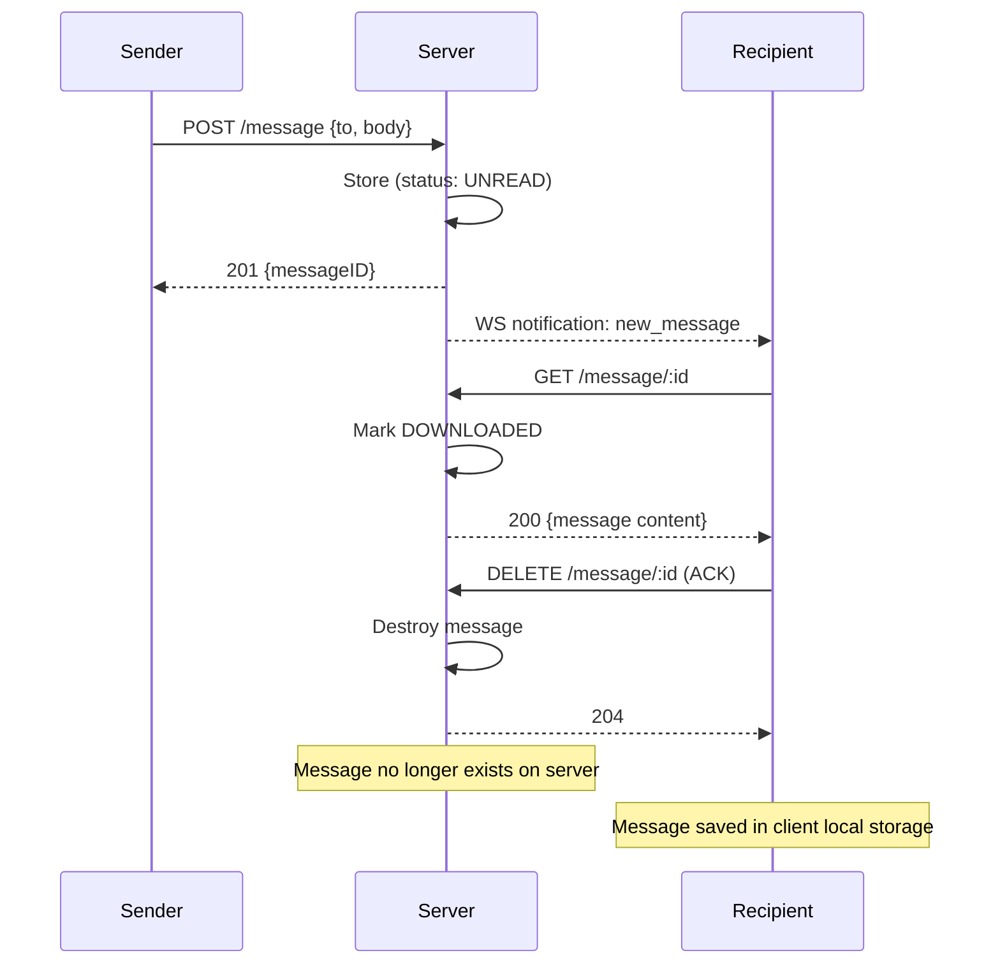
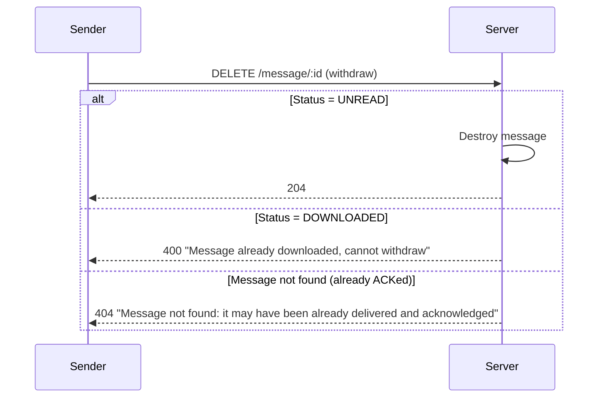

# ADR-001: Message Relay Pattern

## Status
Accepted

## Context
SiSMoChat needs a server-side component to deliver messages between users. The key question is how much data the server should store and for how long.

## Options Considered

1. **Persistent server-side storage (PostgreSQL)**
   - Pro: full message history, standard approach
   - Con: cost, server holds sensitive data, overkill for the use case

2. **Peer-to-peer (no server)**
   - Pro: maximum privacy, no server costs
   - Con: NAT traversal complexity, both users must be online, still needs signaling server

3. **Server as temporary relay + SQLite** ✅
   - Pro: privacy by design, free deployment, simple
   - Con: messages lost if server dies before delivery
   - Mitigation: client is source of truth, can resync

## Decision
The server acts as a temporary message relay. Messages are stored only until the recipient downloads them, then deleted.

## Message Lifecycle
1. Sender → POST → message stored (status: UNREAD)
2. Recipient → GET → message marked DOWNLOADED (prevents sender withdrawal)
3. Recipient → DELETE → message removed from server (ACK)
4. Undelivered messages → auto-purged after TTL (default 30 days)

### Sender Withdrawal

## Consequences
- Client is the source of truth for message history
- Server data is minimal and ephemeral
- SQLite is sufficient as production DB
- No need for expensive database infrastructure
- If server loses state, clients can re-register and re-push undelivered messages
