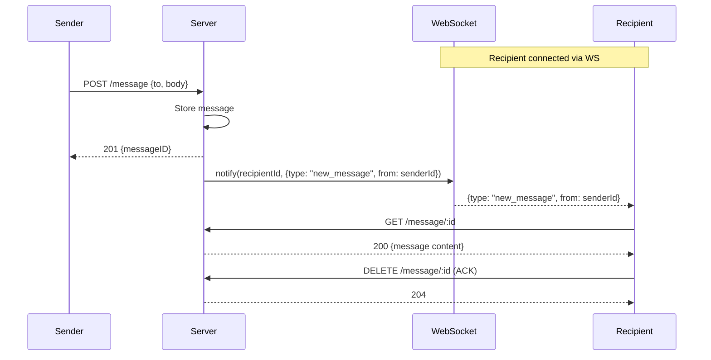
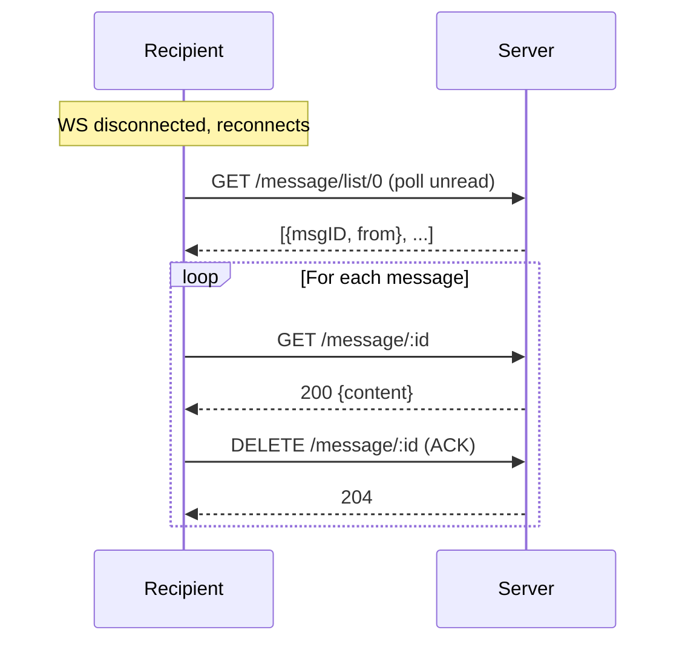

# ADR-003: WebSocket Notification-Only

## Status
Accepted

## Context
The app needs real-time message delivery. Without WebSocket, users must manually refresh or the client must poll.

## Options Considered

1. **WebSocket delivers message content directly**
   - Pro: faster, fewer HTTP calls
   - Con: if WS disconnects mid-delivery, message may be lost; duplicates relay logic

2. **WebSocket as notification only, REST for content** ✅
   - Pro: relay pattern unchanged, WS is just a signal, fallback to polling works
   - Con: extra HTTP round-trip after notification

3. **Long polling**
   - Pro: no WebSocket infrastructure needed
   - Con: higher latency, more server load, not truly real-time

## Decision
WebSocket is notification-only. When a message is sent, the server notifies the recipient via WS (`{ type: 'new_message', from: senderId }`). The client then uses the existing REST endpoints (GET + DELETE) to download and ACK.

## Implementation
- Library: `ws` (lightweight, native WebSocket)
- Authentication: JWT as query param (`ws://server/ws?token=JWT`)
- Server maintains `userId → Set<connections>` map
- Auto-reconnect client-side with exponential backoff
- Notifications: `new_message`, `connection_request`, `connection_status`

## Sequence Diagram

### Fallback (WS disconnected)

## Consequences
- REST endpoints remain the single source of truth for message delivery
- If WS is down, client falls back to polling on reconnect
- No message content travels over WS (privacy: only notification signals)
- Server code changes are minimal (add `notify()` call after existing operations)
