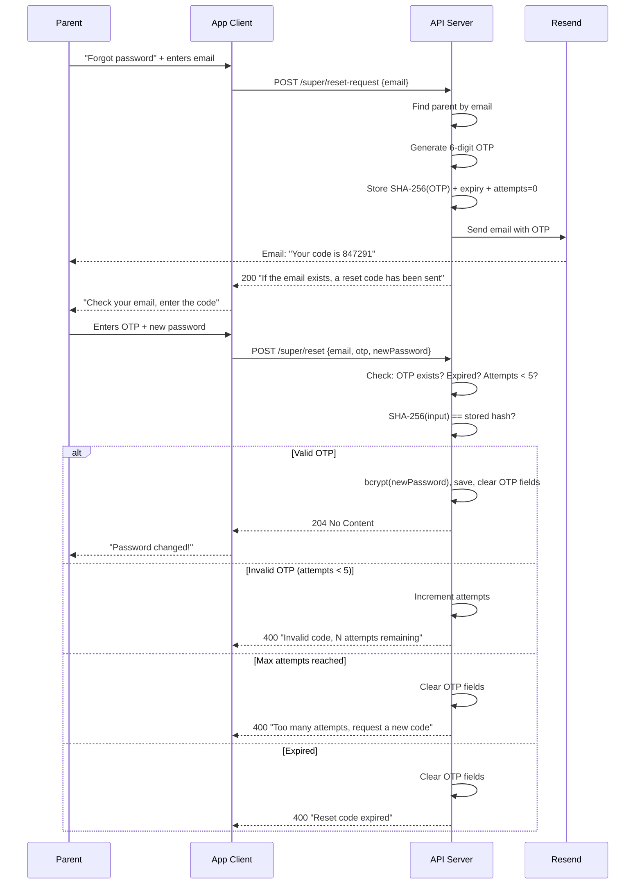

# ADR-005: Password Reset via OTP

## Status
Accepted

## Context
Parents can forget their password and have no recovery mechanism. Child accounts use device-based auth and are unaffected. We need a password reset flow that is secure, simple for non-technical users (parents), and consistent with the project's privacy-first, low-cost architecture.

## Options Considered

### Token delivery method

1. **UUID token in a clickable link (deep link)**
   - Pro: standard UX for web apps
   - Con: requires a domain, app store accounts, or a web client — none of which exist yet

2. **UUID token to copy/paste**
   - Pro: no infrastructure needed
   - Con: long string, error-prone on mobile

3. **6-digit numeric OTP** ✅
   - Pro: easy to type on mobile, familiar UX (like banking apps)
   - Con: smaller keyspace — mitigated by attempt limiting

### Email provider

1. **Nodemailer + SMTP (Gmail, Brevo, etc.)**
   - Pro: zero vendor lock-in, standard protocol
   - Con: more config, Gmail may block automated sends

2. **Resend** ✅
   - Pro: free tier (100/day), no domain required, 3 lines of code
   - Con: vendor-specific (but trivially replaceable)

3. **SendGrid / Amazon SES**
   - Pro: battle-tested at scale
   - Con: overkill, heavier SDK, SES requires sandbox exit

### OTP storage

1. **Store OTP in plaintext**
   - Con: DB compromise leaks valid OTPs

2. **Store OTP as bcrypt hash**
   - Pro: strong hashing
   - Con: overkill for a 30-minute ephemeral value, slower

3. **Store OTP as SHA-256 hash** ✅
   - Pro: fast, irreversible, sufficient for short-lived token
   - Con: no salt — acceptable given 30-min TTL + 5 attempts max

## Decision

- **6-digit numeric OTP** sent via email, entered manually in the app
- **Resend** as email provider (free tier, `onboarding@resend.dev` sender)
- **SHA-256 hash** stored in DB (columns on `parents` table, no separate table)
- **30-minute TTL** (configurable via `RESET_TOKEN_TTL_MINUTES`)
- **Max 5 attempts** — after which OTP is invalidated
- **Rate limit**: 3 reset requests per email per 15 minutes
- **Response does not reveal** whether the email exists (prevents enumeration)

## Consequences

## Sequence Diagram

## Consequences

- No domain or app store account needed to ship this feature
- Email may land in spam (mitigated by user-facing note about `onboarding@resend.dev`)
- When a custom domain is available, switch sender address in env var — no code change
- Replacing Resend with another provider requires changing only `services/email.js`
- OTP columns on `parents` table keep the schema simple (no extra table)
