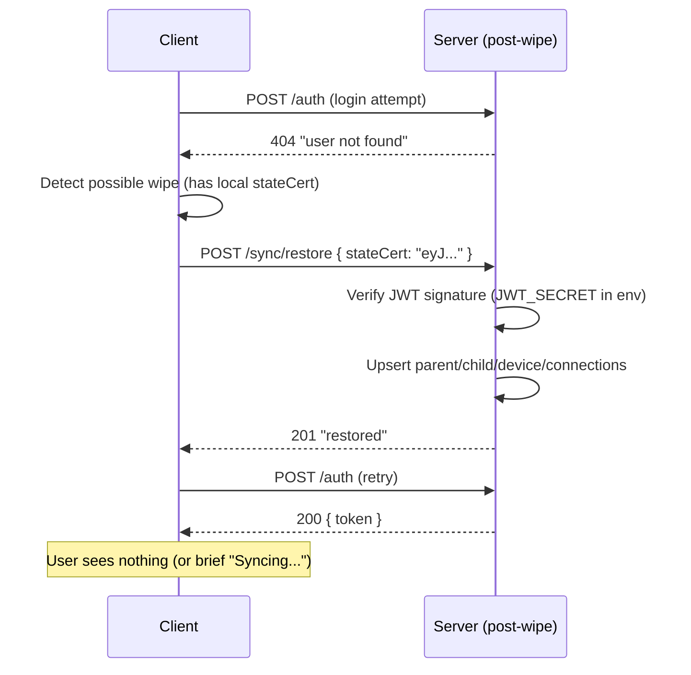

# ADR-006: Client-Seeded Recovery via Signed State

## Status
Proposed

## Context
SiSMoChat is designed as a temporary message relay where the client is the source of truth. Free-tier hosting platforms (Render, Koyeb) provide ephemeral filesystems — the SQLite database is lost on every deploy or restart. This means parent accounts, child users, devices, and connections are wiped.

We need a recovery mechanism that:
- Costs nothing (no paid persistent storage)
- Works on any hosting platform
- Requires no manual intervention from users
- Is consistent with the privacy-first, client-as-source-of-truth architecture

## Options Considered

1. **External DB (Supabase, Turso, managed PostgreSQL)**
   - Pro: persistent by nature
   - Con: vendor lock-in, requires code changes (ORM/driver), free tiers have limitations (pausing, expiry)

2. **Periodic backup of SQLite to object storage (S3, R2)**
   - Pro: keeps SQLite, platform-agnostic
   - Con: backup lag (data loss between backups), complexity, requires external storage account

3. **Client-seeded recovery with server-signed state** ✅
   - Pro: zero external dependencies, platform-agnostic, consistent with existing architecture, zero cost
   - Con: requires client-side implementation, first-login-after-wipe has slight delay

## Decision

Implement a **signed state certificate** system:

### Certificate Content
A JWT (signed with `JWT_SECRET`) containing the client's full recoverable state:

**Parent certificate:**
```json
{
  "type": "parent",
  "id": "uuid",
  "email": "parent@mail.com",
  "pwdHash": "$2b$10$...",
  "children": [
    { "id": "uuid", "nick": "alice", "devices": [...] }
  ],
  "connections": [
    { "from": "uuid", "to": "uuid", "status": 1 }
  ],
  "issuedAt": "2026-05-18T12:00:00Z"
}
```

**Child certificate:**
```json
{
  "type": "child",
  "id": "uuid",
  "nick": "alice",
  "parentId": "uuid",
  "deviceId": "uuid",
  "connections": [...],
  "issuedAt": "2026-05-18T12:00:00Z"
}
```

### Issuance
Server issues/updates the certificate on:
- Parent registration
- Password change
- Child user creation
- Device creation
- Connection approval

Response includes a `stateCert` field that the client must store locally.

### Recovery Flow



### Security
- Certificate is signed by server — client cannot forge state
- `JWT_SECRET` persists in platform env vars (survives wipes)
- Certificate stored in plaintext on client device (see rationale below)
- Password hash in certificate is bcrypt (not reversible)
- Certificate has `issuedAt` — server can reject stale certificates if needed

### Certificate Storage — Encryption Considered and Rejected

We evaluated encrypting the state certificate in localStorage with the parent's password (AES). This was rejected because:

1. **Single point of failure**: if the parent forgets the password and the server has wiped, the encrypted cert becomes unrecoverable — defeating the purpose of the recovery mechanism
2. **Minimal security benefit**: the cert is a JWT signed with `JWT_SECRET`. Without the server's secret key, the cert is useless to an attacker (cannot be used for restore on a different server)
3. **No sensitive content exposed**: the cert contains only UUIDs, nicknames, bcrypt hashes (irreversible), and connection metadata. No plaintext passwords or messages
4. **Transport security is sufficient**: the cert travels over HTTPS and is stored locally on the user's device

The recovery flow after password reset remains safe: restore recreates the account (with old password hash), then the parent can use OTP reset to set a new password.

### Conflict Resolution
- All restores use **upsert** (INSERT ... ON CONFLICT UPDATE)
- Multiple clients can restore independently in any order
- Parent restore is "heavier" (includes children), child restore is "lighter" (just itself)
- Duplicate data is idempotent — no corruption from double-restore

## Consequences

- **Enables free-tier hosting** with ephemeral filesystem (Render, Koyeb, etc.)
- **Platform-agnostic** — no dependency on specific hosting features
- **Zero additional cost** — no external DB or storage needed
- **Transparent to users** — recovery happens automatically on login
- **Client must store certificate** — if client loses local storage AND server wipes, data is lost (acceptable: same as losing your phone)
- **Slight complexity** in client logic (detect wipe, trigger restore, retry)
- **Certificate size** grows with connections — acceptable for expected scale
